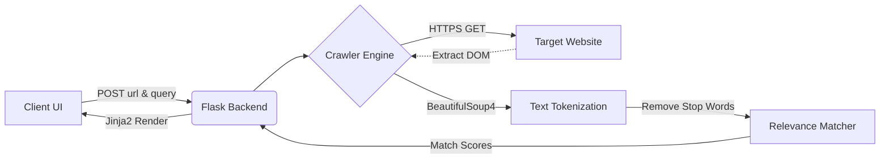

<div align="center">

<!-- You can replace this with a real logo/banner later -->


# 🕸️ Nexus DeepSearch Crawler

*A lightning-fast, sleek, and highly extensible Python Web Crawler & Minimalist Search Engine.*

[](https://python.org)
[](https://flask.palletsprojects.com/)
[](https://www.crummy.com/software/BeautifulSoup/)
[](https://opensource.org/licenses/MIT)

</div>

---

## ⚡ The Vision

**Nexus DeepSearch** bridges the gap between raw web scraping scripts and a premium user experience. Built with a sleek, dark-mode SaaS aesthetic inspired by Vercel and Stripe, it provides a seamless interface to dynamically index deep-web pages out of the box. 

Don't just scrape data. **Search it, analyze it, and experience it.**

---

## 📸 Interface Preview

<div align="center">
  <blockquote>
    <i>"A User Interface that feels like a premium enterprise product."</i>
  </blockquote>
  
  <p><em>(Add your actual screenshot to your repo and update the src link above!)</em></p>
</div>

---

## 🚀 Core Features

| Feature | Description |
| :--- | :--- |
| **🌐 On-The-Fly Indexing** | Scrape and index any live URL instantly without pre-caching. |
| **🛡️ Bot-Block Evasion** | Built-in standard `User-Agent` headers and SSL verification bypass to crawl strict domains (like Wikipedia). |
| **🎯 Smart Keyword Matching** | Input specific keywords to instantly retrieve exact density and relevance scores from the indexed DOM. |
| **🎨 Ultra-Premium UI** | Fully custom CSS3 UI featuring glassmorphism surfaces, automated loading states, and smooth grid transitions. |

---

## 🏗️ Architecture Flow



---

## 🛠️ Tech Stack & Dependencies

* **Core Engine**: `Python 3`, `Requests`
* **Web Framework**: `Flask`
* **DOM Parsing**: `BeautifulSoup4 (bs4)`
* **Text Processing**: Standard Library Regex (`re`)
* **Frontend Design**: Vanilla HTML5, Advanced CSS3 (Flexbox/Grid/Keyframes)

---

## ⚙️ Quick Start Guide

### 1. Clone & Enter Repository
```bash
git clone https://github.com/yourusername/nexus-crawler.git
cd nexus-crawler
```

### 2. Environment Setup
Create a virtual environment (highly recommended) and install the backend requirements:
```bash
python -m venv .venv
source .venv/bin/activate  # On Windows use: .venv\Scripts\activate
pip install flask requests beautifulsoup4
```

### 3. Ignite the Server
```bash
python app.py
```

### 4. Experience Nexus
Open your favorite modern browser and navigate to:
[**`http://127.0.0.1:5000`**](http://127.0.0.1:5000)

---

## 💡 Usage Example

1. **Target URL**: Paste `https://en.wikipedia.org/wiki/Machine_learning` into the designated URL bar.
2. **Keyword**: Type `Python` into the Keyword bar.
3. **Execute**: Hit **Analyze & Search**. 
4. *Result*: The system will index the entirety of the wiki page dynamically, and spit back a pristine Result Card showing you exactly how relevant "Python" is to that URL.

---

<div align="center">
  <p>Ready to index the web? Build something awesome.</p>
  <b><a href="#-nexus-deepsearch-crawler">Back to top ⬆️</a></b>
</div>
