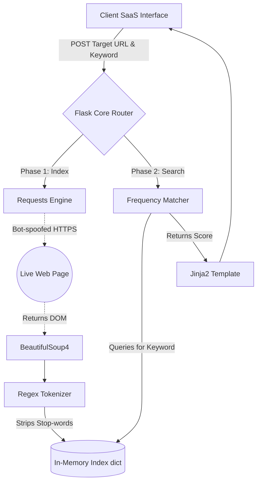

<div align="center">


# 🕸️ Nexus DeepSearch Crawler

*A lightning-fast, ultra-modern Python Web Crawler & Search Engine built for absolute precision.*

[](https://python.org)
[](https://flask.palletsprojects.com/)
[](https://www.crummy.com/software/BeautifulSoup/)
[](https://opensource.org/licenses/MIT)

**[Explore the Docs](#-comprehensive-documentation)** | **[View Live Demo](#-live-demo)** | **[Report a Bug](https://github.com/chandanm0005/Web-Crawler-IR-/issues)**

</div>

---

## ⚡ Overview & The Vision

**Nexus DeepSearch** bridges the gap between raw backend web-scraping scripts and premium, user-first search experiences. By instantly parsing DOM elements, intelligently extracting core conversational content, and bypassing common bot-protection roadblocks (like SSL verification traps and default `User-Agent` blocks), Nexus serves as a robust indexing powerhouse.

Gone are the days of terminal-only scripts. With a bespoke, dark-mode SaaS interface built cleanly on Vanilla CSS3, you can query massive domains and visualize the semantic relevance of any keyword on-the-fly.

Whether you're building an **Information Retrieval (IR)** project from scratch or need an automated workflow that searches domains instantly, Nexus has you covered.

---

## 🚀 Live Demo

[**You can click on this-->**]
https://web-crawler-ir-1.onrender.com/


<br/>

<div align="center">
  <blockquote>

  </blockquote>
  
  <p><em>
</em></p>
</div>

---

## 💎 Core Features

Nexus DeepSearch isn't just a basic scraper. It offers advanced search functionalities with unparalleled UX/UI.

| Capability | Detailed Description |
| :--- | :--- |
| **🌐 On-The-Fly Indexing** | Scrape and cache any live URL instantly without requiring an external database. All DOM data is mapped immediately into memory. |
| **🛡️ Bot-Block Evasion** | Native `User-Agent` spoofing masquerades requests as standard Mozilla browsers to bypass high-security domains like Wikipedia and Medium. Local SSL verification checks can also be natively bypassed. |
| **🎯 Smart Keyword Matching** | Employs Natural Language Processing (NLP) foundations to actively strip out grammatical stop-words (`is`, `a`, `the`, `and`) to find genuine keyword-density scores. |
| **✨ Ultra-Premium UI** | Fully custom CSS3 UI featuring beautiful glassmorphism surfaces, targeted UX, and a dynamic results feed that cascades upon query execution. |
| **📑 Dual-Input Architecture** | You can submit a fresh Target URL *and* your Keyword simultanously. The engine will seamlessly handle the crawl request and pipe the data directly to the search index! |

---

## 🏗️ Deep-Dive Architecture

The backend of the crawler utilizes an asynchronous dual-mode structure. First, the data is fetched and formatted. Then, the search functionality queries the freshly cleaned data array.



---

## 🛠️ Comprehensive Tech Stack

### 🔹 Backend Infrastructure
* **Core Language**: `Python 3.9+` (Strictly-typed performance)
* **Web Gateway**: `Flask 3.x` (Lightweight synchronous handling)
* **Request Engine**: `Requests 2.x` (HTTP/HTTPS operations)

### 🔹 Scraping & Indexing
* **HTML Parsing**: `BeautifulSoup4 (bs4)` (Fast semantic tree parsing)
* **Regex Engine**: `re` module (Alphanumeric text normalization)
* **NLP Processing**: Custom built stop-word sanitization dictionaries.

### 🔹 Frontend Design
* **Structuring**: Valid HTML5
* **Aesthetics**: Vanilla Advanced CSS3 (Flexbox, CSS Grid, Modals, Keyframe Animations)
* **Typography**: Google Fonts API (`Inter` framework)

---

## ⚙️ Exhaustive Installation & Launch Guide

Follow these highly detailed instructions to get your local environment configured, packages installed, and the Flask server ignited.

### Step 1: Clone the Web Crawler Repository
Use Git to pull the raw code down to your local machine:
```bash
git clone https://github.com/chandanm0005/Web-Crawler-IR-.git
cd Web-Crawler-IR-
```

### Step 2: Establish the Python Environment
We heavily recommend initiating a Virtual Environment so global packages don't interfere with the crawler constraints:
```bash
# Generate the virtual environment footprint
python -m venv .venv

# Activate it (macOS/Linux)
source .venv/bin/activate

# Activate it (Windows)
.venv\Scripts\activate
```

### Step 3: Install Core Dependencies
Install the required scraping and routing wheels explicitly listed in the requirements file:
```bash
pip install -r requirements.txt
```
*(Alternatively, you can manually run `pip install flask requests beautifulsoup4 urllib3`)*

### Step 4: Ignite the Application Server
Fire up the Flask debug routing engine:
```bash
python app.py
```
*The command line will output: `* Running on http://127.0.0.1:5000`*

### Step 5: Launch the Interface!
1. Open your sleekest, modern web browser (Chrome, Edge, Safari, Brave).
2. Enter the designated local port: [**`http://127.0.0.1:5000`**](http://127.0.0.1:5000)

---

## 💡 How to Properly Index & Search (Use Case)

If you boot the server and notice that searching for terms brings back empty results, you need to populate the index first! The application is designed to ingest new URLs organically.

1. **Target URL**: Paste `https://en.wikipedia.org/wiki/Machine_learning` into the designated "Target URL" bar at the top of the GUI.
2. **Search Keyword**: Type `Python` into the Keyword bar right underneath it.
3. **Execute**: Hit **Analyze & Search**. 
4. **The Magic**: The backend executes the proxy-browser script, bypasses Wikipedia's strict bot checks, extracts the dense HTML, removes the 40+ filler 'stop-words', and searches the raw semantic tree for the term "Python". 
5. **The Result**: A pristine "Result Card" will generate dynamically on your screen showing you the precise `Match Score` relevance density for that page.

---

## 🛡️ License

This project is open-source and available under the terms of the MIT License. You are free to copy, modify, distribute, and launch your own derivatives of the Nexus Crawler engine!

<hr />
<br />
<div align="center">
  <p>Engineered with ❤️ & ☕ by <b><a href="https://github.com/chandanm0005">Chandan</a></b></p>
  <b><a href="#-nexus-deepsearch-crawler">Back to top ⬆️</a></b>
</div>
